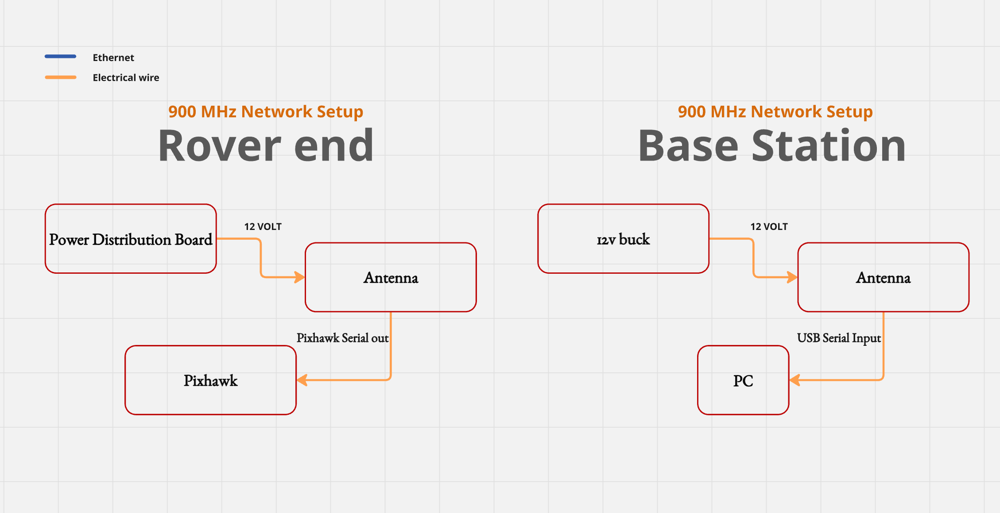

# 📡 Rover & Base Station Network Setup

This repository documents the **5.8 GHz** and **900 MHz** network setups for the Rover and Base Station systems.
It includes diagrams for both setups, showing **Ethernet (blue)** and **Electrical wiring (orange)** connections.

---

## 📑 Contents
1. [5.8 GHz Network Setup — Rover End](#58-ghz-network-setup--rover-end)
2. [5.8 GHz Network Setup — Base Station](#58-ghz-network-setup--base-station)
3. [900 MHz Network Setup — Rover & Base Station](#900-mhz-network-setup--rover--base-station)
4. [System Notes & Power Requirements](#system-notes--power-requirements)
5. [Folder Structure](#folder-structure)

---

## 5.8 GHz Network Setup — Rover End


The 5.8 GHz Rover End setup is divided into three labeled sections in the diagram:

### 1️⃣ Section 1 — Antenna via POE Switch
- **Power Distribution Board** supplies **24V** to:
  - **POE Injector**, which powers the **POE Switch**.
  - **POE Switch** connects directly to the **Antenna** via Ethernet.

### 2️⃣ Section 2 — PC and Antenna via POE Wire
- **Power Distribution Board** outputs **24V** to a **POE Wire**.
- **POE Wire** splits into:
  - **PC (LAN connection)**
  - **Antenna**

### 3️⃣ Section 3 — Multi-device Setup
- **Power Distribution Board** sends:
  - **24V** to **POE Wire** for the Antenna.
  - **12V** to a **Switch** for multiple PCs/devices.

---

## 5.8 GHz Network Setup — Base Station


**Flow:**  
1. **Socket** provides power to the **POE Injector** and **Switch**.  
2. **POE Injector** sends Ethernet+Power to the **Antenna**.  
3. **Switch** distributes network to multiple PCs/devices.  

---

## 900 MHz Network Setup — Rover & Base Station


**Rover End**
- **Power Distribution Board** connects to the **Antenna**.
- **Antenna** communicates with **Pixhawk** using electrical wiring.

**Base Station**
- **12V buck converter** powers the **Antenna**.
- **Antenna** communicates with **Pixhawk**.

---

## System Notes & Power Requirements
- **Ethernet cables (blue)** are used for data transmission between switches, PCs, and antennas.
- **Electrical wires (orange)** deliver power to network devices.
- **POE (Power over Ethernet)** allows single-cable power + data transfer for antennas.
- **Voltage levels:**
  - **24V** for POE-powered devices.
  - **12V** for switches or specific electronics.
- The **Pixhawk** is used in the 900 MHz setup for control/data relay.

---

## Folder Structure
```
.
├── README.md
└── images
    ├── 58ghz_rover.png
    ├── 58ghz_base.png
    └── 900mhz_rover_base.png
```

> Tip: If you rename files, update the image paths in the README accordingly.
